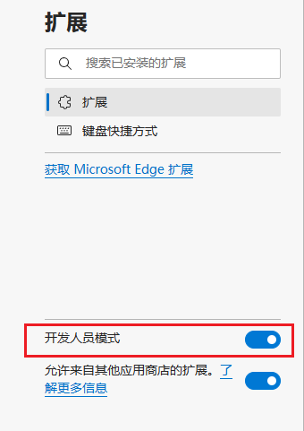
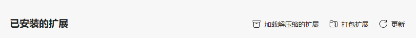
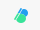
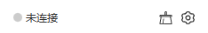
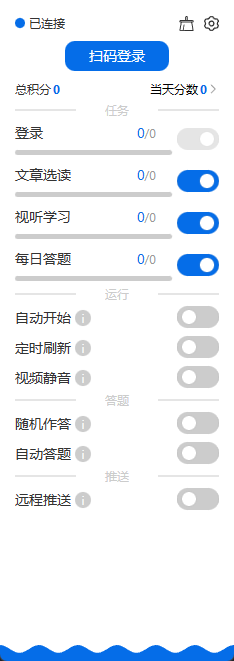
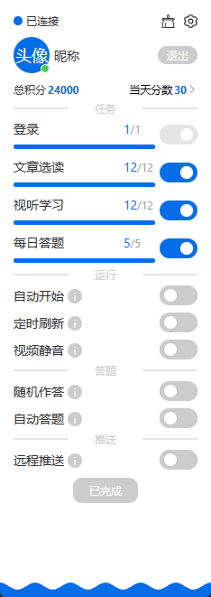

# tech-study-plugin

### 描述 Description

- 一个基于 chrome 浏览器插件的学习强国助手

> 注意： 项目仍在开发阶段，功能尚不完全，如出现 bug ，属于正常情况，请及时反馈，谢谢！

### 交流群 Telegram Group

- 链接： [tech-study 互动群](https://t.me/+IJ_YzNc-Iew0MGRl)

- 二维码：

  

注：介于脚本国内敏感，暂时不提供其他交流互动方式。

### 安装 Install

1. 下载 Release 发布里最新版本的压缩包`tech-study-plugin.zip`

2. 解压压缩包到常用的文件夹，便于查找文件夹路径

3. 配置 chrome 或者 edge 浏览器（以下以 edge 浏览器为例）

   - 进入 `edge://extensions/` 页面

   - 打开开发者模式选项

   

   - 加载解压的扩展文件，确认安装扩展

   

   - 在扩展栏显示插件图标

    

### 保留 Keep

1. 支持二维码扫码，以及基于 pushplus 远程推送的登录方式

2. 支持用户昵称、头像、总分以及当天分数的显示

3. 支持任务进度以及任务分数详情显示

4. 支持文章选读以及视听学习

5. 支持自动答题以及处理滑动验证

### 使用流程 Process

1.  点击`扩展图标`或者在`强国`右键菜单

    - 扩展图标 

    - 右键菜单 

2.  连接扩展

    - 检查扩展的连接状况

       

    - 若显示`未连接`,可采取以下办法：

      - 刷新已有的强国页面

      - 打开新的强国页面

    - 若显示`已连接`，直接下一步

3.  登录账号

    

4.  开始任务，等待任务完成

    

### 交流学习 Learning

1. 本项目采用 `typescript` + `less` 编写，由 `rollup` 进行打包构建

2. 使用 `rollup` 插件列表

   - rollup-plugin-typescript2 解析打包 `typescript` 文件

   - rollup-plugin-postcss 解析打包 `less` 文件

   - rollup-plugin-create-html 将打包后的 `*.js`、`*.css ` 等文件注入 html 模板（自己写的模块）

   - @rollup/plugin-node-resolve 解析打包导入的 `node_modules` 中的模块

   - @rollup/plugin-commonjs 解析打包基于 `commonjs` 的模块

   - @rollup/plugin-terser 代码压缩

3. 手写的 `Composition API` 和 元素节点渲染模块，支持收集数据的影响以进行数据变化以及影响结果的回调，支持数据驱动的响应式元素节点以及异步元素节点的渲染（简化版 [Composition API](./src/utils/composition.ts) 以及 [元素节点渲染](./src/utils/element.ts) ）
